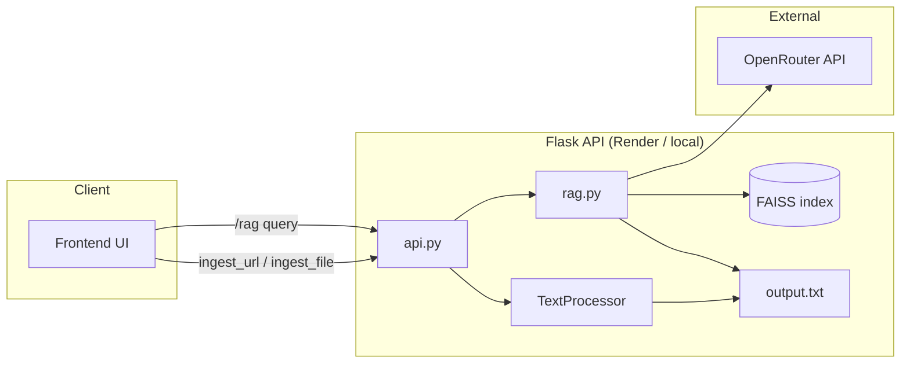

# RAG System for Domain-Specific Question Answering

A full-stack Retrieval-Augmented Generation (RAG) application. Upload documents or provide a URL, build a local FAISS vector index from the extracted text, and ask questions grounded in that content. The UI is a chat-style assistant; the backend is a Flask API powered by [OpenRouter](https://openrouter.ai/) (OpenAI-compatible chat and embeddings).

**Live demo:** [https://rag-nu-drab.vercel.app/]

---

## Features

- **Multi-source ingestion** — PDF, DOCX, TXT, JSON files, or web URLs
- **Vector search** — FAISS index with incremental updates when new content is ingested
- **Grounded answers** — LangChain pipeline retrieves relevant chunks before calling the LLM
- **Chat UI** — Conversation history, URL/file ingestion controls, and feedback buttons
- **Split deployment** — Static frontend on Vercel, API on Render (or run everything locally)

---

## Architecture



| Step | What happens |
|------|----------------|
| 1. Ingest | File or URL is converted to plain text and saved as `runtime/output.txt` |
| 2. Index | On each question, text is chunked, embedded, and stored in `runtime/faiss_index` |
| 3. Answer | User query retrieves similar chunks; GPT answers using that context only |

---

## Project structure

```
RAG/
├── backend/
│   ├── api.py                 # Flask routes + serves frontend
│   ├── rag.py                 # LangChain RAG + FAISS
│   ├── TextProcessor.py       # PDF/DOCX/URL/JSON/TXT → text
│   ├── uploadValidification.py
│   ├── requirements.txt
│   └── render.yaml            # Render.com service config
├── frontend/
│   ├── index.html
│   ├── script.js
│   ├── style.css
│   ├── config.js              # API base URL for production
│   └── vercel.json
├── runtime/                   # Created at runtime (gitignored)
│   ├── output.txt             # Processed document text
│   ├── faiss_index/           # Vector store
│   └── uploads/               # Uploaded files
├── .env.example
├── requirements.txt           # Points to backend/requirements.txt
└── README.md
```

---

## Prerequisites

- **Python 3.10.13** (see `.python-version` / `backend/runtime.txt`)
- **OpenRouter API key** — [Create an account](https://openrouter.ai/) and generate a key
- *(Optional)* **Node/npm** — only if you deploy or preview the frontend separately on Vercel

---

## Environment variables

Copy the example file and fill in your key:

```bash
cp .env.example .env
```

| Variable | Required | Description |
|----------|----------|-------------|
| `OPENROUTER_API_KEY` | Yes | API key from OpenRouter (`sk-or-...`) |
| `OPENROUTER_HTTP_REFERER` | No | Site URL for OpenRouter rankings (e.g. `http://localhost:10000`) |
| `OPENROUTER_TITLE` | No | App name shown to OpenRouter (e.g. `RAG 1.0`) |
| `PORT` | No | Server port (default: `10000`) |

Example `.env`:

```env
OPENROUTER_API_KEY="sk-or-..."
OPENROUTER_HTTP_REFERER="http://localhost:10000"
OPENROUTER_TITLE="RAG 1.0"
```

---

## Local setup and run

### 1. Clone and enter the project

```bash
git clone <your-repo-url>
cd RAG
```

### 2. Create a virtual environment (recommended)

```bash
python -m venv .venv

# Windows
.venv\Scripts\activate

# macOS / Linux
source .venv/bin/activate
```

### 3. Install dependencies

From the **project root**:

```bash
pip install -r backend/requirements.txt
```

### 4. Configure environment

Create `.env` from `.env.example` and set `OPENROUTER_API_KEY`.

### 5. Start the server

From the **project root** (so `backend` imports resolve correctly):

```bash
python -m backend.api
```

The app listens on `http://0.0.0.0:10000` (or the port in `PORT`).

### 6. Open the UI

In your browser:

**http://127.0.0.1:10000/**

The Flask app serves the frontend and API from one origin, so no extra CORS or `config.js` changes are needed locally.

---

## Usage workflow

Follow this order every time you work with new content:

### Step 1 — Ingest knowledge

Choose **one or more** sources (each successful ingest updates `runtime/output.txt`):

| Method | UI | Supported types |
|--------|-----|-----------------|
| **URL** | Paste URL → link button | Public `http`/`https` pages (HTML text extraction) |
| **File** | Choose file → check button | `.pdf`, `.docx` in UI; API also accepts `.txt`, `.json` |

Wait for a success message such as *"File processed successfully!"* before asking questions.

### Step 2 — Ask questions

1. Type your question in the message box.
2. Press **Send** (or Enter).
3. The backend loads or updates the FAISS index, retrieves relevant passages, and returns an answer in the chat.

### Step 3 — (Optional) Add more sources

Ingest another URL or file. New text is merged into the vector store when it is not already indexed (duplicates are skipped).

### Step 4 — New chat / history

- **New Chat** — starts a fresh conversation in the sidebar.
- **History** — previous threads are stored in the browser (`localStorage`), not on the server.

> **Important:** You must ingest at least once before `/rag` will work. If nothing was ingested, the API returns an error that no processed context was found.

---

## API reference

Base URL:

- **Local:** `http://127.0.0.1:10000`
- **Production:** set in `frontend/config.js` as `window.RAG_API_BASE_URL`

### `POST /ingest_url`

Ingest content from a web page.

**Body (JSON):**

```json
{ "url": "https://example.com/docs" }
```

**Success:** `200` — `{ "message": "File processed successfully!" }`

### `POST /ingest_file`

Upload a document (`multipart/form-data`, field name `file`).

**Allowed extensions:** `pdf`, `docx`, `json`, `txt`

**Success:** `200` — `{ "message": "File processed successfully!" }`

### `POST /rag`

Ask a question against ingested content.

**Body (JSON):**

```json
{ "query": "What is the main topic of the document?" }
```

**Success:** `200` — `{ "answer": "..." }`

**Errors:** `400` (missing query), `429` (quota/rate limit), `500` (processing failure)

### Static UI

| Route | Description |
|-------|-------------|
| `GET /` | Chat UI (`index.html`) |
| `GET /<path>` | Other frontend assets (`style.css`, `script.js`, etc.) |

---

## Models (OpenRouter)

Configured in `backend/rag.py`:

| Role | Model |
|------|--------|
| Chat | `openai/gpt-5.2` |
| Embeddings | `openai/text-embedding-3-small` |

Billing and rate limits depend on your OpenRouter account. Quota errors surface as HTTP `429` in the UI.

---

## Deployment

### Backend — Render

1. Connect the GitHub repo to [Render](https://render.com/).
2. Use the settings in `backend/render.yaml` (or equivalent):
   - **Build:** `pip install -r requirements.txt` (from repo root, which installs `backend/requirements.txt`)
   - **Start:** `gunicorn backend.api:app --bind 0.0.0.0:$PORT`
3. Add environment variables in the Render dashboard: `OPENROUTER_API_KEY`, and optionally `OPENROUTER_HTTP_REFERER`, `OPENROUTER_TITLE`.
4. Note the public URL (e.g. `https://rag-vywc.onrender.com`).

> Render free tier may spin down after inactivity; the first request can be slow.

### Frontend — Vercel

1. Deploy the `frontend/` directory (or the whole repo with root set to `frontend`).
2. Edit `frontend/config.js` and set `window.RAG_API_BASE_URL` to your Render API URL (no trailing slash):

   ```js
   window.RAG_API_BASE_URL = "https://your-service.onrender.com";
   ```

3. Ensure Render allows CORS from your Vercel domain (`flask-cors` is enabled in `api.py`).

### Combined local / single-server mode

Running `python -m backend.api` serves both UI and API — useful for development without Vercel.

---

## Troubleshooting

| Issue | What to check |
|-------|----------------|
| `OPENROUTER_API_KEY is not set` | `.env` exists in project root and key is set; restart the server |
| `No processed context found` | Run URL or file ingest before asking a question |
| `Could not connect to backend` (Vercel) | `config.js` points to the correct Render URL; Render service is awake |
| `429` / quota errors | OpenRouter credits or rate limits; wait or upgrade plan |
| FAISS dimension mismatch | Usually auto-rebuilds; delete `runtime/faiss_index` and ask again |
| Empty or wrong answers | Re-ingest source; try a more specific question |

Clear local runtime data (optional):

```bash
# Windows PowerShell
Remove-Item -Recurse -Force runtime

# macOS / Linux
rm -rf runtime
```

---

## Development notes

- Run RAG from the CLI (after ingest): `python -m backend.rag`
- Test file conversion: `python -m backend.TextProcessor`
- Python version is pinned to **3.10.13** for compatibility with Render and local tooling.

---

## License

No licence
